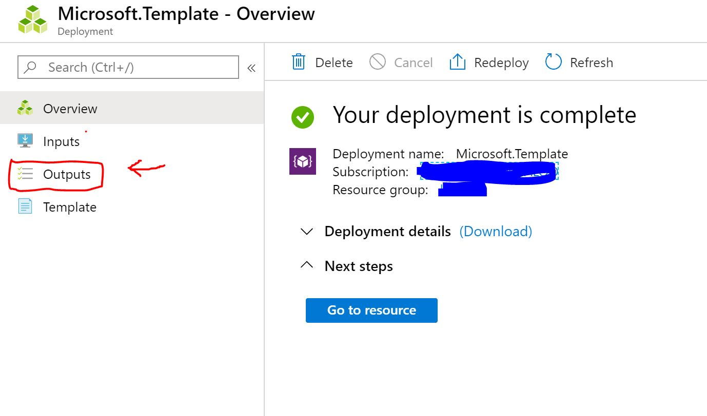
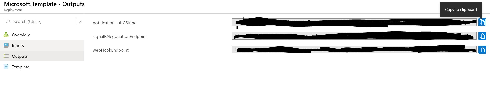

# Azure IoT Central Notification Bridge

This repository contains everything you need create a notification bridge to push notifications from IoT Central app to native (iOS, Android) and web (browser) platforms. In your IoT Central app, you can build rules to trigger notifications when telemetry values change for single devices or a set of them. This solution will provision several Azure resources into your Azure subscription that work together to provide notifications for the various supported platforms.

To use the notification bridge solution, you will need the following:
- an Azure account. You can create a free Azure account from [here](https://aka.ms/aft-iot)
- an Azure IoT Central application to connect the devices. Create a free app by following [these instructions](https://docs.microsoft.com/en-us/azure/iot-central/quick-deploy-iot-central)
- Either a Google Firebase API Key, an Apple Push Notification certificate or both for project credentials (see [Get Credentials](#get-credentials) for instructions).

## Instructions
Take the following steps to deploy an Azure Function into your subscription and set up the notification bridge.

1. Click the `Deploy to Azure` button above. This opens up a custom ARM template in the Azure Portal to deploy the Azure resources.

2. Get the application project credentials (FCM, APNS or both), if already available, following [Get Credentials](#get-credentials) instructions and paste them in the parameters fields of the deployment form opened in Azure Portal.

3. After the deployment is done, required endpoints become available as deployment output.

 The 3 outputs are:
- **notificationHubCString**: Connection string for Azure notification hub to be used in native clients.
- **signalRNegotiationEndpoint**: Negotiation endpoint for SignalR service. To be used in web clients to get authentication token and connection details.
- **webHookEndpoint**: URL target for Azure IoTCentral webhook action. See [IoTCentral instructions.](#setup-iotcentral-webhooks)

5. After client successfully connects to notification service, it will start receiving notifications for requested devices.

## Sample clients
The sample folder contains examples of simple client applications for web and mobile. The sample mobile application is written in React Native but there are other code references available in the [official Azure Notification Hub documentation](https://docs.microsoft.com/en-us/azure/notification-hubs/) for various languages.

The current implementation uses IoTCentral deviceId as *username* for the connection so the client application will only receive notifications related to specified devices. Client can subscribe to multiple devices notifications by opening different channels to the Notification Hub.
The same notification can be received by multiple mobile applications or browser instances after negotiation.

## What is being provisioned? (pricing)
The custom template in this repository will provision the following Azure resources:
- Storage Account
- Function App
- Consumption Plan
- Notification Hub
- SignalR

The Function App runs on a [consumption plan](https://azure.microsoft.com/en-us/pricing/details/functions/).
While this option does not offer dedicated compute resources, it allows notification bridge to handle
**hundreds of messages per minute**
If your application needs to push a large number of notifications, you may choose to replace the
consumption plan by dedicated a [App Service Plan](https://azure.microsoft.com/en-us/pricing/details/app-service/windows/).
This plan offers dedicated compute resources, which leads to faster server response times.
Using a standard App Service Plan, the maximum observed performance of the Azure Function in this repository was around
**1,500 device messages per minute**. You can learn more about the [Azure Function hosting options
in documentation](https://docs.microsoft.com/en-us/azure/azure-functions/functions-scale).

## Setup IoTCentral webhooks
Follow instructions for creating webhook actions on rules in Azure IoTCentral at [https://docs.microsoft.com/en-us/azure/iot-central/core/howto-create-webhooks.](https://docs.microsoft.com/en-us/azure/iot-central/core/howto-create-webhooks)
The application will send POST request to the endpoint specified.
## Get Credentials
To use native notifications for Android and iOS you need to be enrolled in Google or Apple developer programs and register the mobile application project.

Instructions for creating a project and getting credentials iOS can be found here:

- [iOS](https://docs.microsoft.com/en-us/azure/notification-hubs/notification-hubs-ios-apple-push-notification-apns-get-started#generate-the-certificate-signing-request-file)
- [Android](https://docs.microsoft.com/en-us/azure/notification-hubs/notification-hubs-android-push-notification-google-fcm-get-started#create-a-firebase-project-that-supports-fcm) 

## CORS
By default CORS is set to allow all requests in order to quickly test the environment. This is not a valid configuration for production use so remember to change the option to a list of valid sources before when move to public.
Instructions on changing CORS configuration for Azure Functions available [here.](https://docs.microsoft.com/en-us/azure/azure-functions/functions-how-to-use-azure-function-app-settings#cors)